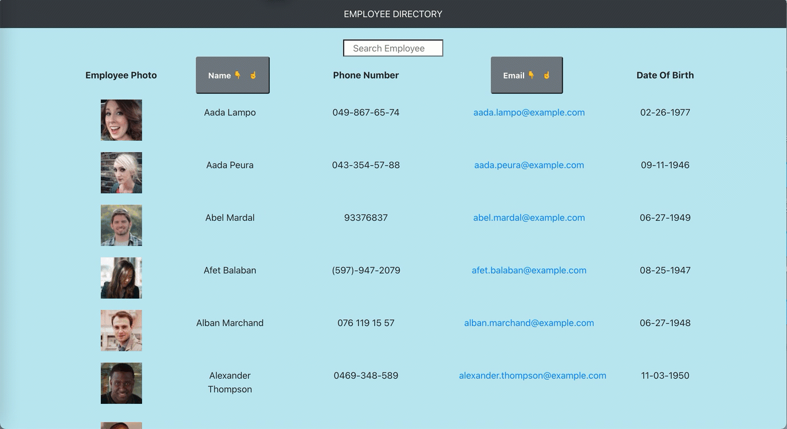

# Employee_Directory
A simple React App to let you view your entire employee directory at once so that you have quick access to their information.

## User Story

* As a user, I want to be able to view my entire employee directory at once so that I have quick access to their information.

## Business Context

An employee or manager would benefit greatly from being able to view non-sensitive data about other employees. It would be particularly helpful to be able to filter employees by name.

## Acceptance Criteria

Given a table of random users generated from the [Random User API](https://randomuser.me/), when the user loads the page, a table of employees render. 

you be able to:

  * Sort the table by Employee Name

  * Filter the users by Date of Birth

  * Search an Employee by name

## How does it looks?

go to the link to open on the browser
-  https://alhelimi.github.io/Employee_Directory/index.html

## Contributing

- https://github.com/AlheliMi/Employee_Directory.git

Please feel free to pull, comment, add, update, discuss or even just chat @ alhealhe72@hotmail.com 
